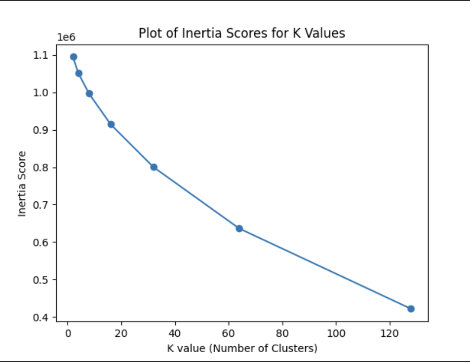

# Clustering with K-Means, PCA, and SVD

## Project Description
This project uses a standard Movies dataset with corresponding Movie Ratings data. K-Means clustering, PCA Analysis, and SVD analysis are performed
on the dataset and plotted for easy understanding. However, the most important data portions come from the console, in which the top 3 movies
based upon rating and viewership are displayer, the top 3 movies from each of the 32 clusters are 
displayed, and critical metrics including how many clusters to account for 80% of the variance in the data are displayed.

## Code Visualizations

### K-means Inertia Scores

### PCA Plot

### SVD Plot

## License

This project is licensed under the terms of the [MIT License](https://opensource.org/licenses/MIT).